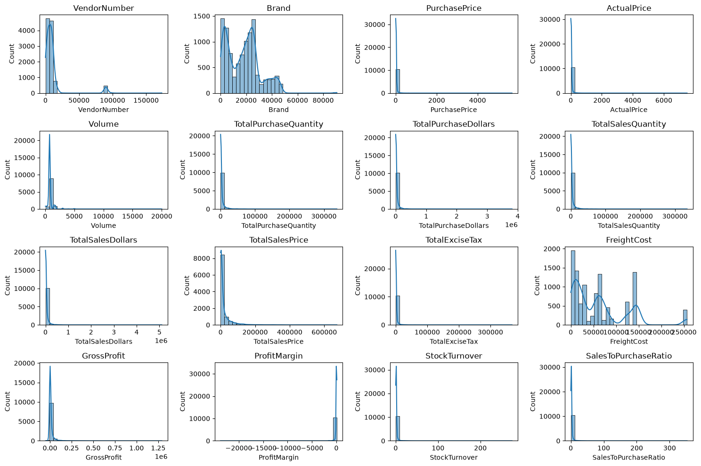
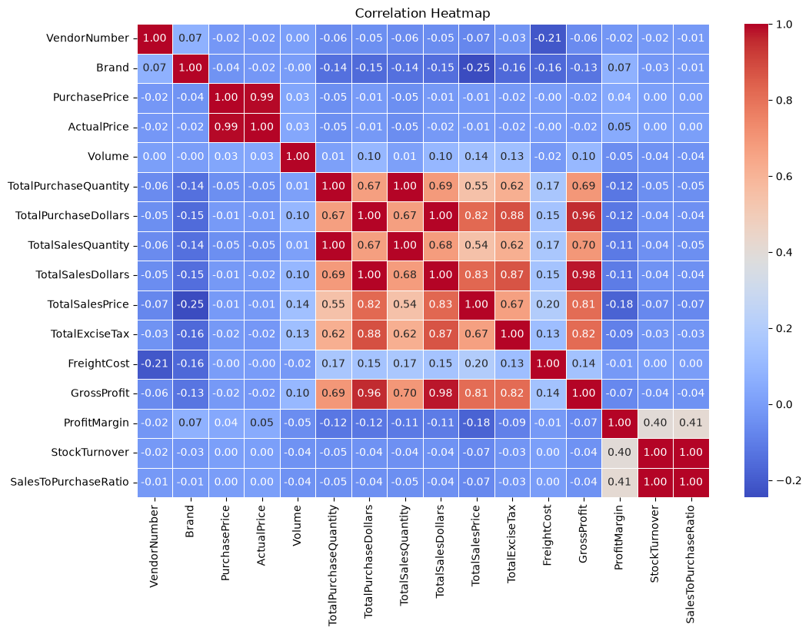
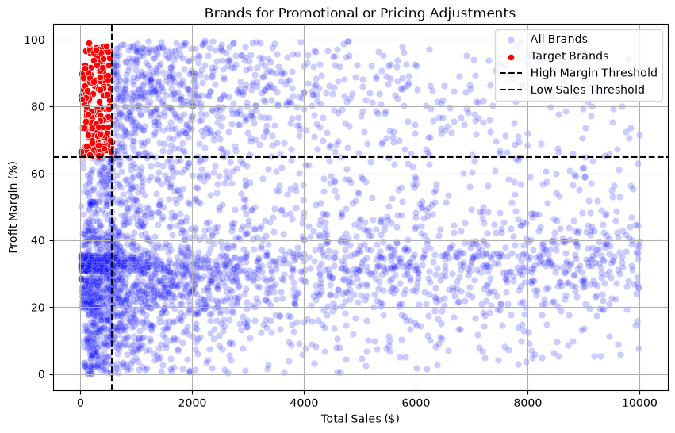
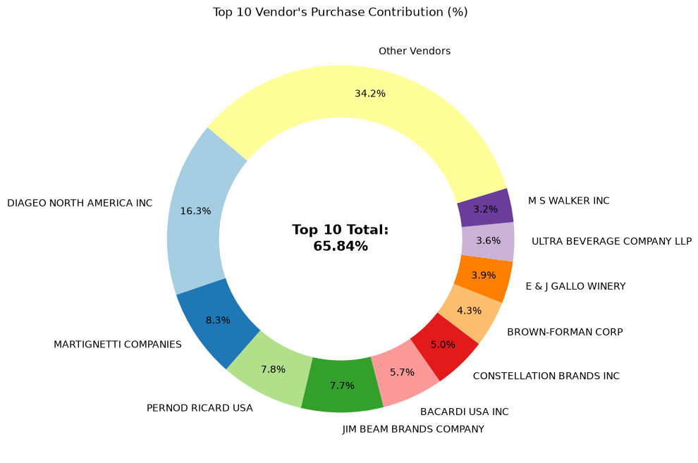
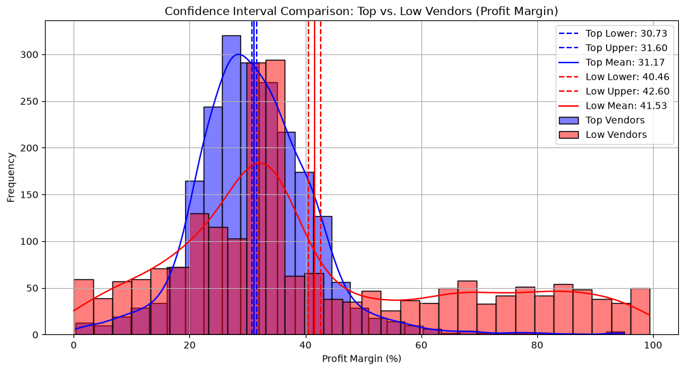

## Vấn đề kinh doanh

Quản lý hàng tồn kho và hoạt động bán hàng hiệu quả là yếu tố rất quan trọng để **tối ưu hóa lợi nhuận** trong ngành bán lẻ và bán buôn. Doanh nghiệp cần đảm bảo rằng họ không phát sinh thua lỗ do **định giá kém hiệu quả, vòng quay hàng tồn kho thấp hoặc phụ thuộc quá mức vào nhà cung cấp**.

Mục tiêu của phân tích này là:

- Xác định các thương hiệu có hiệu suất thấp cần điều chỉnh **chương trình khuyến mãi hoặc chiến lược giá**.
- Xác định các nhà cung cấp hàng đầu đóng góp nhiều nhất vào **doanh số và lợi nhuận gộp**.
- Phân tích tác động của việc **mua hàng số lượng lớn** đến chi phí trên mỗi đơn vị sản phẩm.
- Đánh giá **vòng quay hàng tồn kho** nhằm giảm chi phí lưu kho và nâng cao hiệu quả hoạt động.
- Phân tích sự khác biệt về **khả năng sinh lời** giữa nhóm nhà cung cấp có hiệu suất cao và nhóm nhà cung cấp có hiệu suất thấp.

## Nhận định từ Phân tích Khám phá Dữ liệu (EDA)

### Thống kê mô tả

<table border="1" class="dataframe">
  <thead>
    <tr style="text-align: right;">
      <th></th>
      <th>count</th>
      <th>mean</th>
      <th>std</th>
      <th>min</th>
      <th>25%</th>
      <th>50%</th>
      <th>75%</th>
      <th>max</th>
    </tr>
  </thead>
  <tbody>
    <tr>
      <th>VendorNumber</th>
      <td>10648.0</td>
      <td>10640.705203</td>
      <td>18700.404409</td>
      <td>2.00</td>
      <td>3943.5000</td>
      <td>7153.000</td>
      <td>9552.0000</td>
      <td>173357.00</td>
    </tr>
    <tr>
      <th>Brand</th>
      <td>10648.0</td>
      <td>18054.503193</td>
      <td>12643.196784</td>
      <td>58.00</td>
      <td>5816.5000</td>
      <td>18776.500</td>
      <td>25521.2500</td>
      <td>90631.00</td>
    </tr>
    <tr>
      <th>PurchasePrice</th>
      <td>10648.0</td>
      <td>24.402095</td>
      <td>109.483355</td>
      <td>0.36</td>
      <td>6.8400</td>
      <td>10.450</td>
      <td>19.4700</td>
      <td>5681.81</td>
    </tr>
    <tr>
      <th>ActualPrice</th>
      <td>10648.0</td>
      <td>35.671184</td>
      <td>148.534066</td>
      <td>0.49</td>
      <td>10.9900</td>
      <td>15.990</td>
      <td>28.9900</td>
      <td>7499.99</td>
    </tr>
    <tr>
      <th>Volume</th>
      <td>10648.0</td>
      <td>847.883922</td>
      <td>665.354103</td>
      <td>50.00</td>
      <td>750.0000</td>
      <td>750.000</td>
      <td>750.0000</td>
      <td>20000.00</td>
    </tr>
    <tr>
      <th>TotalPurchaseQuantity</th>
      <td>10648.0</td>
      <td>3145.159936</td>
      <td>11113.367455</td>
      <td>1.00</td>
      <td>36.0000</td>
      <td>261.000</td>
      <td>1981.2500</td>
      <td>337660.00</td>
    </tr>
    <tr>
      <th>TotalPurchaseDollars</th>
      <td>10648.0</td>
      <td>30138.163064</td>
      <td>123277.154715</td>
      <td>0.71</td>
      <td>452.8575</td>
      <td>3646.725</td>
      <td>20764.1700</td>
      <td>3811251.60</td>
    </tr>
    <tr>
      <th>TotalSalesQuantity</th>
      <td>10648.0</td>
      <td>3081.902047</td>
      <td>10971.073340</td>
      <td>0.00</td>
      <td>33.0000</td>
      <td>260.500</td>
      <td>1934.2500</td>
      <td>334939.00</td>
    </tr>
    <tr>
      <th>TotalSalesDollars</th>
      <td>10648.0</td>
      <td>42302.921643</td>
      <td>167947.264974</td>
      <td>0.00</td>
      <td>728.2750</td>
      <td>5285.915</td>
      <td>28414.0500</td>
      <td>5101919.51</td>
    </tr>
    <tr>
      <th>TotalSalesPrice</th>
      <td>10648.0</td>
      <td>18813.647626</td>
      <td>45018.406384</td>
      <td>0.00</td>
      <td>288.8300</td>
      <td>2841.775</td>
      <td>16080.2700</td>
      <td>672819.31</td>
    </tr>
    <tr>
      <th>TotalExciseTax</th>
      <td>10648.0</td>
      <td>1775.333762</td>
      <td>10992.438862</td>
      <td>0.00</td>
      <td>4.8000</td>
      <td>46.355</td>
      <td>418.3750</td>
      <td>368242.80</td>
    </tr>
    <tr>
      <th>FreightCost</th>
      <td>10648.0</td>
      <td>61481.720250</td>
      <td>61024.808162</td>
      <td>0.27</td>
      <td>14069.8700</td>
      <td>50293.620</td>
      <td>79528.9900</td>
      <td>257032.07</td>
    </tr>
    <tr>
      <th>GrossProfit</th>
      <td>10648.0</td>
      <td>12191.259672</td>
      <td>46296.040383</td>
      <td>-52002.78</td>
      <td>54.4575</td>
      <td>1408.400</td>
      <td>8702.2875</td>
      <td>1290667.91</td>
    </tr>
    <tr>
      <th>ProfitMargin</th>
      <td>10648.0</td>
      <td>-15.499534</td>
      <td>444.392025</td>
      <td>-23730.64</td>
      <td>13.4575</td>
      <td>30.440</td>
      <td>39.9625</td>
      <td>99.72</td>
    </tr>
    <tr>
      <th>StockTurnover</th>
      <td>10648.0</td>
      <td>1.704649</td>
      <td>6.006821</td>
      <td>0.00</td>
      <td>0.8100</td>
      <td>0.980</td>
      <td>1.0400</td>
      <td>274.50</td>
    </tr>
    <tr>
      <th>SalesToPurchaseRatio</th>
      <td>10648.0</td>
      <td>2.501234</td>
      <td>8.436432</td>
      <td>0.00</td>
      <td>1.1600</td>
      <td>1.440</td>
      <td>1.6700</td>
      <td>352.93</td>
    </tr>
  </tbody>
</table>

### Giá trị âm và bằng 0

- **Gross Profit (Lợi nhuận gộp):** Giá trị nhỏ nhất là **-52.002,78**, cho thấy có khả năng phát sinh thua lỗ do chi phí cao hoặc mức chiết khấu lớn. Điều này có thể xảy ra khi sản phẩm được bán với mức giá thấp hơn giá mua.

- **Profit Margin (Biên lợi nhuận):** Giá trị nhỏ nhất là **-∞**, cho thấy tồn tại những trường hợp doanh thu bằng 0 hoặc thấp hơn tổng chi phí, dẫn đến biên lợi nhuận âm ở mức rất lớn.

- **Total Sales Quantity & Sales Dollars:** Một số sản phẩm có doanh số bằng **0**, cho thấy chúng đã được mua nhưng chưa từng được bán. Đây có thể là các sản phẩm **bán chậm (slow-moving)** hoặc hàng tồn kho lỗi thời (`obsolete stock`), làm giảm hiệu quả quản lý hàng tồn kho.

### Giá trị ngoại lệ được thể hiện qua độ lệch chuẩn cao

- **Purchase Price & Actual Price:** Giá trị lớn nhất lần lượt là **5.681,81** và **7.499,99**, cao hơn đáng kể so với giá trị trung bình tương ứng là **24,39** và **35,64**. Điều này cho thấy có thể tồn tại các sản phẩm thuộc phân khúc giá cao (`premium products`).

- **Freight Cost (Chi phí vận chuyển):** Chi phí vận chuyển biến động rất lớn, từ **0,09** đến **257.032,07**. Điều này có thể phản ánh sự thiếu hiệu quả trong logistics, các lô hàng có quy mô lớn hoặc chi phí vận chuyển không ổn định giữa các sản phẩm khác nhau.

- **Stock Turnover (Vòng quay hàng tồn kho):** Giá trị dao động từ **0** đến **274,5**, cho thấy một số sản phẩm được bán rất nhanh trong khi một số khác tồn kho trong thời gian dài. Giá trị lớn hơn **1** cho thấy số lượng bán ra của sản phẩm cao hơn số lượng mua vào trong giai đoạn phân tích, có thể do doanh nghiệp sử dụng hàng tồn kho từ các kỳ trước để đáp ứng đơn hàng.

### Lọc dữ liệu

Để nâng cao độ tin cậy của các kết quả phân tích, chúng ta loại bỏ những điểm dữ liệu không nhất quán trong các trường hợp sau:

- **Gross Profit ≤ 0:** Loại bỏ các giao dịch dẫn đến thua lỗ.
- **Profit Margin ≤ 0:** Đảm bảo phân tích tập trung vào các giao dịch có khả năng sinh lời.
- **Total Sales Quantity = 0:** Loại bỏ các sản phẩm tồn kho chưa từng phát sinh bán hàng.

### Nhận định từ phân tích tương quan

- **Purchase Price so với Total Sales Dollars & Gross Profit:** Có mối tương quan yếu, lần lượt là **-0,012** và **-0,016**, cho thấy biến động của giá mua không có mối liên hệ đáng kể với doanh thu bán hàng hoặc lợi nhuận gộp.

- **Total Purchase Quantity so với Total Sales Quantity:** Có mối tương quan dương rất mạnh **0,999**, cho thấy số lượng mua vào và số lượng bán ra biến động gần như đồng thời.

- **Profit Margin so với Total Sales Price:** Có mối tương quan âm **-0,179**, cho thấy khi tổng giá bán tăng thì biên lợi nhuận có xu hướng giảm nhẹ, có thể liên quan đến áp lực cạnh tranh về giá.

- **Stock Turnover so với Gross Profit & Profit Margin:** Có mối tương quan âm yếu, lần lượt là **-0,038** và **-0,055**, cho thấy tốc độ luân chuyển hàng tồn kho cao hơn không nhất thiết đi kèm với khả năng sinh lời cao hơn.

## Câu hỏi nghiên cứu và các phát hiện chính

### 1. Các thương hiệu cần điều chỉnh chương trình khuyến mãi hoặc chiến lược giá

<table border="1" class="dataframe">
  <thead>
    <tr style="text-align: right;">
      <th></th>
      <th>Description</th>
      <th>TotalSalesDollars</th>
      <th>ProfitMargin</th>
    </tr>
  </thead>
  <tbody>
    <tr>
      <th>6197</th>
      <td>Santa Rita Organic Svgn Bl</td>
      <td>9.99</td>
      <td>66.47</td>
    </tr>
    <tr>
      <th>2369</th>
      <td>Debauchery Pnt Nr</td>
      <td>11.58</td>
      <td>65.98</td>
    </tr>
    <tr>
      <th>2070</th>
      <td>Concannon Glen Ellen Wh Zin</td>
      <td>15.95</td>
      <td>83.45</td>
    </tr>
    <tr>
      <th>2188</th>
      <td>Crown Royal Apple</td>
      <td>27.86</td>
      <td>89.81</td>
    </tr>
    <tr>
      <th>6235</th>
      <td>Sauza Sprklg Wild Berry Marg</td>
      <td>27.96</td>
      <td>82.15</td>
    </tr>
    <tr>
      <th>...</th>
      <td>...</td>
      <td>...</td>
      <td>...</td>
    </tr>
    <tr>
      <th>5072</th>
      <td>Nanbu Bijin Southern Beauty</td>
      <td>535.68</td>
      <td>76.75</td>
    </tr>
    <tr>
      <th>2271</th>
      <td>Dad's Hat Rye Whiskey</td>
      <td>538.89</td>
      <td>81.85</td>
    </tr>
    <tr>
      <th>57</th>
      <td>A Bichot Clos Marechaudes</td>
      <td>539.94</td>
      <td>67.74</td>
    </tr>
    <tr>
      <th>6243</th>
      <td>Sbragia Home Ranch Merlot</td>
      <td>549.75</td>
      <td>66.44</td>
    </tr>
    <tr>
      <th>3325</th>
      <td>Goulee Cos d'Estournel 10</td>
      <td>558.87</td>
      <td>69.43</td>
    </tr>
  </tbody>
</table>

198 rows × 3 columns

Có **198 thương hiệu** có doanh số thấp nhưng biên lợi nhuận cao. Đây là những thương hiệu có thể hưởng lợi từ các chiến lược **marketing có mục tiêu, chương trình khuyến mãi hoặc tối ưu hóa giá bán** nhằm gia tăng sản lượng tiêu thụ mà không làm ảnh hưởng đáng kể đến khả năng sinh lời.

### 2. Các nhà cung cấp hàng đầu theo mức đóng góp vào doanh số và giá trị mua hàng

Top 10 nhà cung cấp đóng góp **65,69% tổng giá trị mua hàng**, trong khi các nhà cung cấp còn lại chỉ đóng góp **34,31%**.

Mức độ phụ thuộc lớn vào một số ít nhà cung cấp có thể làm gia tăng các rủi ro như **gián đoạn chuỗi cung ứng**, từ đó cho thấy doanh nghiệp cần xem xét **đa dạng hóa nguồn cung và mở rộng mạng lưới nhà cung cấp** để giảm mức độ phụ thuộc.

### 3. Tác động của việc mua hàng số lượng lớn đến khả năng tiết kiệm chi phí

Các nhà cung cấp mua hàng với số lượng lớn nhận được **đơn giá thấp hơn 72%**, với mức chi phí khoảng **10,78 USD trên mỗi đơn vị**, so với mức đơn giá cao hơn ở các đơn hàng có quy mô nhỏ.

Chiến lược **định giá theo số lượng lớn (bulk pricing)** khuyến khích các nhà cung cấp đặt mua với khối lượng lớn hơn, từ đó giúp gia tăng tổng doanh số trong khi vẫn duy trì khả năng sinh lời.

|`OrderSize` | `UnitPurchasePrice` |
|---|---:|
| Small | 39.128653 |
| Medium | 15.489374 |
| Large | 10.776200 |

### 4. Xác định các nhà cung cấp có vòng quay hàng tồn kho thấp

**Tổng số vốn bị tồn đọng trong hàng tồn kho chưa bán: 2,71 triệu USD**

Hàng tồn kho luân chuyển chậm làm gia tăng **chi phí lưu kho**, làm giảm hiệu quả sử dụng dòng tiền và ảnh hưởng tiêu cực đến khả năng sinh lời tổng thể của doanh nghiệp.

Việc xác định các nhà cung cấp có **vòng quay hàng tồn kho thấp** giúp doanh nghiệp quản lý tồn kho hiệu quả hơn, điều chỉnh khối lượng mua hàng phù hợp và giảm áp lực tài chính do vốn bị tồn đọng trong hàng hóa chưa bán.

<table border="1" class="dataframe">
  <thead>
    <tr style="text-align: right;">
      <th></th>
      <th>VendorName</th>
      <th>StockTurnover</th>
    </tr>
  </thead>
  <tbody>
    <tr>
      <th>0</th>
      <td>ALISA CARR BEVERAGES</td>
      <td>0.620000</td>
    </tr>
    <tr>
      <th>36</th>
      <td>HIGHLAND WINE MERCHANTS LLC</td>
      <td>0.710000</td>
    </tr>
    <tr>
      <th>60</th>
      <td>PARK STREET IMPORTS LLC</td>
      <td>0.750000</td>
    </tr>
    <tr>
      <th>19</th>
      <td>Circa Wines</td>
      <td>0.755385</td>
    </tr>
    <tr>
      <th>41</th>
      <td>KLIN SPIRITS LLC</td>
      <td>0.760000</td>
    </tr>
    <tr>
      <th>26</th>
      <td>Dunn Wine Brokers</td>
      <td>0.767500</td>
    </tr>
    <tr>
      <th>15</th>
      <td>CENTEUR IMPORTS LLC</td>
      <td>0.772500</td>
    </tr>
    <tr>
      <th>78</th>
      <td>SMOKY QUARTZ DISTILLERY LLC</td>
      <td>0.780000</td>
    </tr>
    <tr>
      <th>90</th>
      <td>TAMWORTH DISTILLING</td>
      <td>0.800000</td>
    </tr>
    <tr>
      <th>91</th>
      <td>THE IMPORTED GRAPE LLC</td>
      <td>0.808182</td>
    </tr>
  </tbody>
</table>

***

<table border="1" class="dataframe">
  <thead>
    <tr style="text-align: right;">
      <th></th>
      <th>VendorName</th>
      <th>UnsoldInventoryValue</th>
    </tr>
  </thead>
  <tbody>
    <tr>
      <th>25</th>
      <td>DIAGEO NORTH AMERICA INC</td>
      <td>722.21K</td>
    </tr>
    <tr>
      <th>45</th>
      <td>JIM BEAM BRANDS COMPANY</td>
      <td>554.67K</td>
    </tr>
    <tr>
      <th>67</th>
      <td>PERNOD RICARD USA</td>
      <td>470.63K</td>
    </tr>
    <tr>
      <th>115</th>
      <td>WILLIAM GRANT &amp; SONS INC</td>
      <td>401.96K</td>
    </tr>
    <tr>
      <th>30</th>
      <td>E &amp; J GALLO WINERY</td>
      <td>228.28K</td>
    </tr>
    <tr>
      <th>11</th>
      <td>BROWN-FORMAN CORP</td>
      <td>177.73K</td>
    </tr>
    <tr>
      <th>78</th>
      <td>SAZERAC CO INC</td>
      <td>173.03K</td>
    </tr>
    <tr>
      <th>20</th>
      <td>CONSTELLATION BRANDS INC</td>
      <td>133.62K</td>
    </tr>
    <tr>
      <th>60</th>
      <td>MOET HENNESSY USA INC</td>
      <td>126.48K</td>
    </tr>
    <tr>
      <th>76</th>
      <td>REMY COINTREAU USA INC</td>
      <td>118.60K</td>
    </tr>
  </tbody>
</table>

### 5. So sánh biên lợi nhuận giữa nhóm nhà cung cấp có hiệu suất cao và thấp

- **Biên lợi nhuận của nhóm nhà cung cấp hàng đầu (Khoảng tin cậy 95%):** từ **30,74% đến 31,61%**, với giá trị trung bình là **31,17%**.

- **Biên lợi nhuận của nhóm nhà cung cấp có hiệu suất thấp (Khoảng tin cậy 95%):** từ **40,48% đến 42,62%**, với giá trị trung bình là **41,55%**.

Nhóm nhà cung cấp có hiệu suất thấp duy trì **biên lợi nhuận cao hơn**, nhưng gặp khó khăn về sản lượng bán hàng. Điều này có thể phản ánh những vấn đề liên quan đến chiến lược giá chưa tối ưu hoặc khả năng tiếp cận thị trường còn hạn chế.

#### Khuyến nghị hành động

- **Đối với nhóm nhà cung cấp có hiệu suất cao:** Tối ưu hóa khả năng sinh lời bằng cách điều chỉnh giá bán, giảm chi phí vận hành hoặc triển khai các chương trình khuyến mãi theo gói (`bundled promotions`).

- **Đối với nhóm nhà cung cấp có hiệu suất thấp:** Tăng cường hoạt động marketing, tối ưu chiến lược giá và cải thiện mạng lưới phân phối nhằm thúc đẩy sản lượng bán hàng.

### 6. Kiểm định thống kê về sự khác biệt trong biên lợi nhuận

#### Kiểm định giả thuyết

- **H₀ (Giả thuyết không - Null Hypothesis):** Không có sự khác biệt có ý nghĩa thống kê về biên lợi nhuận giữa nhóm nhà cung cấp có hiệu suất cao và nhóm nhà cung cấp có hiệu suất thấp.

- **H₁ (Giả thuyết đối - Alternative Hypothesis):** Có sự khác biệt có ý nghĩa thống kê về biên lợi nhuận giữa hai nhóm nhà cung cấp.

#### Kết quả

**Bác bỏ giả thuyết H₀**, xác nhận rằng hai nhóm nhà cung cấp có sự khác biệt rõ rệt về mô hình sinh lời.

#### Hàm ý

- Các nhà cung cấp có **biên lợi nhuận cao** có thể hưởng lợi từ việc cải thiện chiến lược giá.
- Các nhà cung cấp có **doanh số cao** có thể tập trung nhiều hơn vào việc nâng cao hiệu quả chi phí nhằm cải thiện khả năng sinh lời.

---

## Khuyến nghị cuối cùng

- Đánh giá lại chiến lược giá đối với các thương hiệu có **doanh số thấp nhưng biên lợi nhuận cao** nhằm gia tăng sản lượng bán hàng mà không làm giảm đáng kể khả năng sinh lời.

- **Đa dạng hóa quan hệ với nhà cung cấp** để giảm mức độ phụ thuộc vào một số ít nhà cung cấp và hạn chế rủi ro gián đoạn chuỗi cung ứng.

- Tận dụng lợi thế của **mua hàng số lượng lớn** để duy trì mức giá cạnh tranh, đồng thời tối ưu hóa hoạt động quản lý hàng tồn kho.

- Tối ưu hóa hàng tồn kho bán chậm bằng cách **điều chỉnh khối lượng mua hàng, triển khai chương trình thanh lý hoặc xem xét lại chiến lược lưu kho**.

- Tăng cường các chiến lược **marketing và phân phối** đối với nhóm nhà cung cấp có hiệu suất thấp nhằm thúc đẩy sản lượng bán hàng mà vẫn duy trì biên lợi nhuận.

- Việc triển khai các khuyến nghị trên có thể giúp doanh nghiệp hướng tới **khả năng sinh lời bền vững, giảm thiểu rủi ro và nâng cao hiệu quả hoạt động tổng thể**.